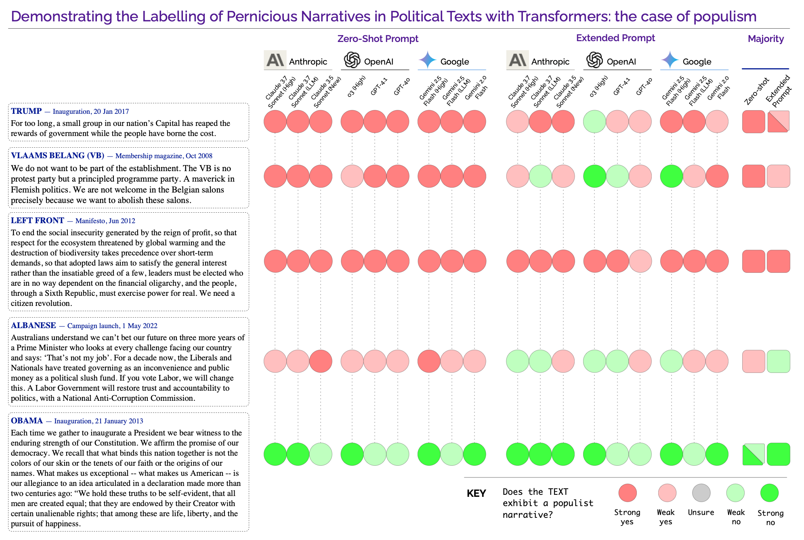

# Data & Codes to accompany: "Tracking Policy-relevant Narratives of Democratic Resilience at Scale: from experts and machines, to AI & the transformer revolution"

[](https://doi.org/10.5281/zenodo.15493085)

[Simon D. Angus](https://research.monash.edu/en/persons/simon-angus)

Dept. of Economics & [SoDa Laboratories](sodalabs.io), Monash Business Schoool, Monash University

&#x1F4C4; Angus, S. D. (2025). Tracking Policy-relevant Narratives of Democratic Resilience at Scale: from experts and machines, to AI & the transformer revolution.

## TL;DR
Analyzing public narratives about democratic resilience used to be slow and manual. New AI tools, especially those using the transformer architecture, can now accurately and efficiently identify these narratives in large amounts of text, offering a powerful new way for social scientists and policymakers to track public discourse.



# Requirements
 * To run **paired completion** experiments (on any narrative), you will need access to relevant API keys (e.g. OpenAI, DeepInfra), and use the https://github.com/sodalabsio/paired-completion package (see requirements therein).
 * To replicate the **immigration figure** from the paper, you will need MATLAB (tested on R2021a).

# Populism labelling with Transformers
The figure from the paper was formed by sending prompts with texts as described in the paper to each of the major model provider models via APIs. Replication would require API keys for each of these providers, following their respective instructions, or simply working with their web interfaces. The system used for the paper was an ensembling system developed by SoDa Labs, which is not publicly available, however, the full output from the system for each call is included in the repository for replication purposes.

## Details
Extraction of the relevant responses and rationales from the output files can be accomplished efficiently using the `run_get_model_response_dir.sh` script in the `prompt-exp/src' folder, using python (testing on python 3.11), e.g.:
```bash
$ chmod +x run_get_model_response_dir.sh          // make the script executable
$ ./run_get_model_response_dir.sh ../3x3-ensemble/with-definition
```
will run over each `.json` output file in the directory and produce a simple `.csv` file with filename `{file}_model_responses.csv` in the same directory.

Note: upon checking all responses, it was evident that one model response was not correctly parsed by the script (`one-shot-world-knowledge/left-front.json`, model: Claude 3.7 Sonnet (High)), the correct response was retrieved manually from the output `.json` file and a note added to the `.csv` file.

The figure was created manually using these data in OmniGraffle (Mac).

# Tracking immigration narratives with Transformers
The second experiment is provided in the folder `paired-completion-exp`. As explained in the paper, the data were obtained from the http://data.openaustralia.org.au/ API endpoint, and filtered using literal matching per the details in the paper. The Paired Completion method was conducted using the https://github.com/sodalabsio/paired-completion package, producing the data file, `llama-2-70b-asylum-seekers-v2_speaker_affil.json` upon which the figure was created.

Note: in the data file, paired-completion conditional log-probabilities for `helpful` and `unhelpful` are generic labels which in this case align with 'humanitarian' and 'border security' respectively.

## Details
To replicate the figure in the paper, one can navigate, in MATLAB to the folder, `paired-completion-exp`, and run the script,
```matlab
>> make_figure
```
This will conduct the dynamic binning of the data (producing `_bin_edges.csv` in the directory) and plot the figure, combining information on federal elections and Prime Minister terms from the data files in the same folder.

Credit: we thank Timothy E. Holy for the excellent `distinguishable_colors.m` function used in the figure.
 *  Tim Holy (2025). Generate maximally perceptually-distinct colors (https://www.mathworks.com/matlabcentral/fileexchange/29702-generate-maximally-perceptually-distinct-colors), MATLAB Central File Exchange. Retrieved May 15, 2025. 
